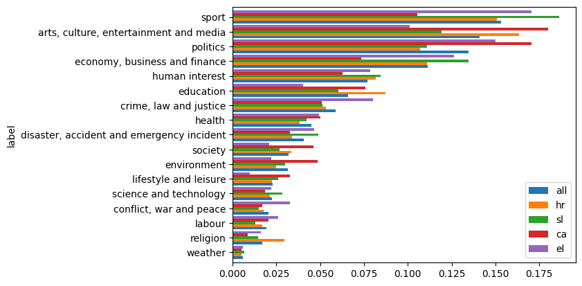
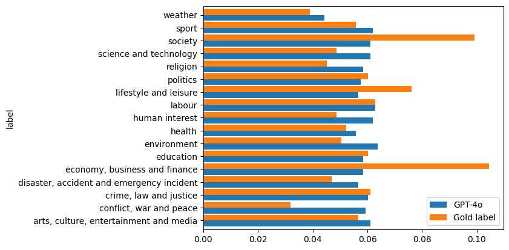
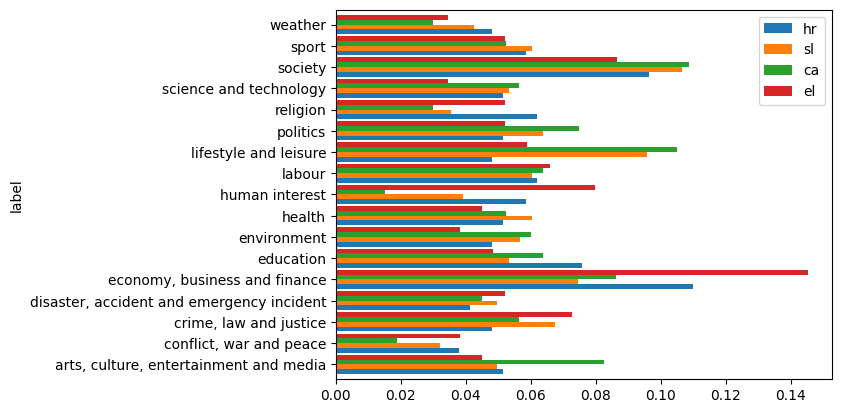

# IPTC Media Topic Classification

This repository documents the development of the IPTC Media Topic classifier that provides single-label classification using the 17 top-level topic labels from the [IPTC NewsCodes Media Topic](https://www.iptc.org/std/NewsCodes/treeview/mediatopic/mediatopic-en-GB.html) hierarchical schema.

Table of content:
- [Data](#data)
- [Published Model](#published-model)
	- [Using the Published Model](#using-the-published-model)
- [Setup & Requirements for Experiments](#setup--requirements-for-experiments)
- [IPTC NewsCodes Media Topic Schema](#iptc-newscodes-media-topic-schema)
- [Data Development](#data-development)
	- [Automatic Annotation with GPT-4o](#automatic-annotation-with-gpt-4o)
	- [Manual Annotation](#manual-annotation)
		- [Inter-Annotator Agreement](#inter-annotator-agreement)
		- [Intra-Annotator Agreement](#intra-annotator-agreement)
- [Fine-Tuning XLM-RoBERTa Student Models](#fine-tuning-xlm-roberta-student-models)
	- [Hyperparameter Search](#hyperparameter-search)
	- [Experiment 1: Comparison of Training Data Sizes](#experiment-1-comparison-of-training-data-sizes)
	- [Experiment 2: Comparison of Monolingual and Multilingual 5k models](#experiment-2-comparison-of-monolingual-and-multilingual-5k-models)
- [Papers](#papers)
- [Acknowledgments](#acknowledgments)


## Data

Final training and test datasets are available at:
- training dataset, annotated with GPT-4o (21,000 texts in 4 languages): *EMMediaTopic dataset*: published on [the CLARIN.SI repository](http://hdl.handle.net/11356/1991)
- test dataset, manually annotated: *IPTC-top-test.jsonl* - available upon request to the authors (kuzman.taja at ijs.si) via [private GitHub repository](https://github.com/clarinsi/IPTC-top-test) inside the CLARIN.SI group

## Published Model

This project produced the following model: Multilingual IPTC Media Topic Classifier [classla/multilingual-IPTC-news-topic-classifier](https://huggingface.co/classla/multilingual-IPTC-news-topic-classifier), openly available on Hugging Face.

The model is based on [large-size XLM-RoBERTa model](https://huggingface.co/FacebookAI/xlm-roberta-large) and fine-tuned on the EMMediaTopic 1.0 news dataset in 4 languages (Croatian, Slovenian, Catalan and Greek), annotated with the top-level [IPTC NewsCodes Media Topic](https://www.iptc.org/std/NewsCodes/treeview/mediatopic/mediatopic-en-GB.html) labels.

Based on a manually-annotated test set (in Croatian, Slovenian, Catalan and Greek), the model achieves macro-F1 score of 0.746, micro-F1 score of 0.734, and accuracy of 0.734, and outperforms the GPT-4o model (version gpt-4o-2024-05-13) used in a zero-shot setting. If we use only labels that are predicted with a confidence score equal or higher than 0.90, the model achieves micro-F1 and macro-F1 of 0.80.

### Using the Published Model

The following script shows how one can use the published model:

```python
from transformers import pipeline

# Load a multi-class classification pipeline - if the model runs on CPU, comment out "device"
classifier = pipeline("text-classification", model="classla/multilingual-IPTC-news-topic-classifier", device=0, max_length=512, truncation=True)

# Example texts to classify
texts = [
	"""Slovenian handball team makes it to Paris Olympics semifinal Lille, 8 August - Slovenia defeated Norway 33:28 in the Olympic men's handball tournament in Lille late on Wednesday to advance to the semifinal where they will face Denmark on Friday evening. This is the best result the team has so far achieved at the Olympic Games and one of the best performances in the history of Slovenia's team sports squads.""",
	"""Moment dog sparks house fire after chewing power bank An indoor monitoring camera shows the moment a dog unintentionally caused a house fire after chewing on a portable lithium-ion battery power bank. In the video released by Tulsa Fire Department in Oklahoma, two dogs and a cat can be seen in the living room before a spark started the fire that spread within minutes. Tulsa Fire Department public information officer Andy Little said the pets escaped through a dog door, and according to local media the family was also evacuated safely. "Had there not been a dog door, they very well could have passed away," he told CBS affiliate KOTV."""]

# Classify the texts
results = classifier(texts)

# Output the results
for result in results:
	print(result)

## Output
## {'label': 'sport', 'score': 0.9985264539718628}
## {'label': 'disaster, accident and emergency incident', 'score': 0.9957459568977356}

```

## Setup & Requirements for Experiments

Code for recreating the environment that was used for the experiments:

Create the conda environment:
```bash
conda create -n IPTC_env python=3.11.10
```

Add the requirements:
```bash
conda env update -n IPTC_env -f environment.yml --prune
```

Activate the new environment:
```bash
conda activate IPTC_env
```

## IPTC NewsCodes Media Topic Schema

Since 2010, the International Press Telecommunications Council (IPTC) maintains a taxonomy for the categorization of news text. This taxonomy takes the form of a tree with 17 top-level topics such as politics, society, or sport. Each topic branches into subtopics until very specific topics are reached, such as adult education, impeachment, or missing person. The taxonomy can be visualized at https://show.newscodes.org/index.html?newscodes=medtop&lang=en-GB&startTo=Show.

For more infromation, see the [IPTC NewsCode Guidelines](https://iptc.org/std/NewsCodes/guidelines/).

Information on all labels, their levels, parent and child labels and definitions can be accessed from the [original spreadsheet](data/IPTC-MediaTopic-NewsCodes-mappings.xlsx) or the extracted JSON dictionary ([iptc_mapping.json](data/iptc_mapping.json)). We use the version of the schema from October 24, 2023.

```
labels = ['disaster, accident and emergency incident',
 'human interest',
 'politics',
 'education',
 'crime, law and justice',
 'economy, business and finance',
 'conflict, war and peace',
 'arts, culture, entertainment and media',
 'labour',
 'weather',
 'religion',
 'society',
 'health',
 'environment',
 'lifestyle and leisure',
 'science and technology',
 'sport']
```

Additionally, for the manual annotation, we implemented 3 additional labels to mark the text that should be discarded (due to being unsuitable or too ambigious - see [Annotation Guidelines](data/IPTC_Annotation_Guidelines.pdf) for the description of the labels):
``` ["do not know", "not news", "multiple"]```

## Data Development

We took samples from the Croatian, Slovenian, Catalan and Greek monolingual [MaCoCu-Genre](http://hdl.handle.net/11356/1969) (Kuzman & Ljubešić, 2024) corpora. More precisely, we took texts that:
- were annotated as "News" with the genre classifier
- consist only of the target language (no paragraphs in the foreign language)
- do not consist of multiple shortened texts - we removed all texts that consist of more than one (...) which is typical for pages with text summaries (comprising sequences like "Read more ...")

According to these criteria, we extracted a random sample of 5,250 texts per language for training and development splits and 2,000 texts per language for the test split.

Prior to performing the GPT-based annotation, the texts were truncated to 512 words (the limitation of BERT-like classifiers).

Code for extraction of training, development and test datasets from the MaCoCu-Genre datasets: [data-development-code/0-extract_sample_from_MaCoCu-Genre.ipynb](data-development-code/0-extract_sample_from_MaCoCu-Genre.ipynb)

### Automatic Annotation with GPT-4o

Code for annotation with GPT-4o model in a zero-shot prompting manner: [data-development-code/1-annotate-with-gpt4o-and-split-training-samples.ipynb](data-development-code/1-annotate-with-gpt4o-and-split-training-samples.ipynb)

We used the GPT-4o model ("gpt-4o-2024-05-13") and the following prompt:

```python
label_dict_with_description_ext = {
	'disaster, accident and emergency incident - man-made or natural events resulting in injuries, death or damage, e.g., explosions, transport accidents, famine, drowning, natural disasters, emergency planning and response.': 0,
	'human interest - news about life and behavior of royalty and celebrities, news about obtaining awards, ceremonies (graduation, wedding, funeral, celebration of launching something), birthdays and anniversaries, and news about silly or stupid human errors.': 1,
	'politics - news about local, regional, national and international exercise of power, including news about election, fundamental rights, government, non-governmental organisations, political crises, non-violent international relations, public employees, government policies.': 2,
	'education - all aspects of furthering knowledge, formally or informally, including news about schools, curricula, grading, remote learning, teachers and students.': 3,
	'crime, law and justice - news about committed crime and illegal activities, the system of courts, law and law enforcement (e.g., judges, lawyers, trials, punishments of offenders).': 4,
	'economy, business and finance - news about companies, products and services, any kind of industries, national economy, international trading, banks, (crypto)currency, business and trade societies, economic trends and indicators (inflation, employment statistics, GDP, mortgages, ...), international economic institutions, utilities (electricity, heating, waste management, water supply).': 5,
	'conflict, war and peace - news about terrorism, wars, wars victims, cyber warfare, civil unrest (demonstrations, riots, rebellions), peace talks and other peace activities.': 6,
	'arts, culture, entertainment and media - news about cinema, dance, fashion, hairstyle, jewellery, festivals, literature, music, theatre, TV shows, painting, photography, woodworking, art exhibitions, libraries and museums, language, cultural heritage, news media, radio and television, social media, influencers, and disinformation.': 7,
	'labour - news about employment, employment legislation, employees and employers, commuting, parental leave, volunteering, wages, social security, labour market, retirement, unemployment, unions.': 8,
	'weather - news about weather forecasts, weather phenomena and weather warning.': 9,
	'religion - news about religions, cults, religious conflicts, relations between religion and government, churches, religious holidays and festivals, religious leaders and rituals, and religious texts.': 10,
	'society - news about social interactions (e.g., networking), demographic analyses, population census, discrimination, efforts for inclusion and equity, emigration and immigration, communities of people and minorities (LGBTQ, older people, children, indigenous people, etc.), homelessness, poverty, societal problems (addictions, bullying), ethical issues (suicide, euthanasia, sexual behavior) and social services and charity, relationships (dating, divorce, marriage), family (family planning, adoption, abortion, contraception, pregnancy, parenting).': 11,
	'health - news about diseases, injuries, mental health problems, health treatments, diets, vaccines, drugs, government health care, hospitals, medical staff, health insurance.': 12,
	'environment - news about climate change, energy saving, sustainability, pollution, population growth, natural resources, forests, mountains, bodies of water, ecosystem, animals, flowers and plants.': 13,
	'lifestyle and leisure - news about hobbies, clubs and societies, games, lottery, enthusiasm about food or drinks, car/motorcycle lovers, public holidays, leisure venues (amusement parks, cafes, bars, restaurants, etc.), exercise and fitness, outdoor recreational activities (e.g., fishing, hunting), travel and tourism, mental well-being, parties, maintaining and decorating house and garden.': 14,
	'science and technology -  news about natural sciences and social sciences, mathematics, technology and engineering, scientific institutions, scientific research, scientific publications and innovation.': 15,
	'sport - news about sports that can be executed in competitions - basketball, football, swimming, athletics, chess, dog racing, diving, golf, gymnastics, martial arts, climbing, etc.; sport achievements, sport events, sport organisation, sport venues (stadiums, gymnasiums, ...), referees, coaches, sport clubs, drug use in sport.': 16}

	structured_prompt_label_description = f"""
			### Task
			Your task is to classify the provided text into a topic label, meaning that you need to recognize what is the topic of the text. You will be provided with a news text, delimited by single quotation marks. Always provide a label, even if you are not sure.

			### Output format
			Return a valid JSON dictionary with the following key: 'topic' and a value should be an integer which represents one of the labels according to the following dictionary: {label_dict_with_description_ext}.
			"""

```

Prediction on 5000 instances cost 39.34€ and took one hour.

The dataset with predictions - the EMMediaTopic 1.0 dataset - consists of 21.000 instances (5250 per language) and is available on [the CLARIN.SI repository](http://hdl.handle.net/11356/1991).

Label distribution on automatically-annotated training and development data:



### Manual Annotation

The guidelines for manual annotation based on the 17 top-level IPTC NewsCodes Media Topic labels are available [here](data/IPTC_Annotation_Guidelines.pdf). The descriptions were developed by the authors of this research to provide more details about which subcategories are included in the top-level labels.

Manual annotation was performed by 1 annotator. For inter-annotator agreement evaluation, additional annotator was used.

Out of the sample for the test dataset (2,000 texts per language) that was automatically annotated by GPT-4o, we extracted smaller samples to be manually annotated. The samples are balanced across labels and consist of 18 instances per label (if possible - some labels had less instances in the sample of 2,000 texts) -> around 300 instances per language. (see code: [data-development-code/2-develop-balanced-test-samples.ipynb](data-development-code/2-develop-balanced-test-samples.ipynb))

Together, the dataset that was manually annotated consisted of 1,199 instances.

After annotation, 70 texts (5.83%) were discarded due to being annotated as:
- "do not know": 49 texts (4%)
- "not news": 2 texts (0.1%)
- "multiple" (multiple texts inside one instance): 19 texts (1.58%)

In addition to providing single labels for each instance, the annotator was allowed to provide multiple labels (in a separate column) in cases where two topics were equally present and intertwined in the text. 191 instances were annotated with multiple labels - 16% of all instances. All of these instances were annotated with 2 labels (- there was none which would be annotated with 3 or more labels). This annotation layer was added as additional information but was not used for training and evaluation in the experiments. We use the single-label annotation to calculate inter-annotator agreement and model performance.

The final test dataset comprises 1,129 instances. It is available on request (contact the author of this work).

Distribution of instances per language:

| lang   |   count |
|:-------|--------:|
| hr     |     291 |
| el     |     289 |
| sl     |     282 |
| ca     |     267 |

Label distribution compared to the label distribution of the predictions:



Distribution of true labels per language:



#### Inter-Annotator Agreement

Inter-Annotator Agreement was calculated on a sample of 339 instances, balanced by labels (provided by the 1st annotator). To this end, a second annotator assigned labels to the sample, without having access to the labels provided by GPT-4o model or the 1st annotator.

We calculate the nominal Krippendorff's Alpha.

| pair                        |   nominal Krippendorff's Alpha |
|:----------------------------|-----------------------------:|
| 2nd annotator & GPT-4o  |                     0.752399 |
| 1st annotator & 2nd annotator  |                     0.727622 |
| 1st annotator & GPT-4o      |                     0.692999 |

Results show satisfactory agreement, higher than 0.667.

The code that was used for calculating inter- and intra-annotator agreement is available at [data-development-code/3-annotation-evaluation.ipynb](data-development-code/3-annotation-evaluation.ipynb).

#### Intra-Annotator Agreement

We also calculate the consistency of the human annotator (1st annotator) versus the GPT annotator, using the nominal Krippendorff's Alpha.

| annotator                                |   nominal Krippendorff's Alpha |
|:------------------------------------|-----------------------------:|
| GPT-4o          |                     0.933966 |
| 1st annotator      |                     0.796385 |

## Fine-Tuning XLM-RoBERTa Student Models

The models are trained and evaluated the training and dev split, respectively, available as the [EMMediaTopic 1.0 dataset](http://hdl.handle.net/11356/1991).

The experiments were ran on a GPU.

The models are evaluated on the manually-annotated test split which is available upon request. See the script [machine-learning-experiments-code/evaluate-on-test-sample.ipynb](machine-learning-experiments-code/evaluate-on-test-sample.ipynb) for the code for evaluation of the models.

The best-performing model has been published to [Hugging Face](https://huggingface.co/classla/multilingual-IPTC-news-topic-classifier) (see Section [Published Model](#published-model)).

### Hyperparameter Search

The hyperparameter search was evaluated on the development split.

To run the hyperparameter search:
`CUDA_VISIBLE_DEVICES=0 nohup python machine-learning-experiments-code/hyperparameter-search.py "10k" > machine-learning-experiments-code/hyperparameter-search-10k-model.md &` where the argument is the model sample size (20k, 15k, 10k, 5k, 2.5k, 1k).

The following optimal hyperparameters were used for all XLM-RoBERTa models, with the epoch number depending on the sample size:

```python
if "20k_sample" in current_sample:
	epoch = 3
elif "15k_sample" in current_sample:
	epoch = 5
elif "10k_sample" in current_sample:
	epoch = 9
elif current_sample in ['5k_sample','5k_sample_2', '5k_sample_3', "5k_sample_4", "5k_sample_5"]:
	epoch = 10
elif "2.5k_sample" in current_sample:
	epoch = 22
elif "1k_sample" in current_sample:
	epoch = 24

model_args = ClassificationArgs()

# define hyperparameters
model_args ={"overwrite_output_dir": True,
			 "labels_list": LABELS,
			 "num_train_epochs": epoch,
			 "learning_rate": 8e-06,
			 "train_batch_size": 32,
			 # Comment out no_cache and no_save if you want to save the model
			 "no_cache": True,
			 "no_save": True,
			# Only the trained model will be saved (if you want to save it)
			# - to prevent filling all of the space
			# "save_model_every_epoch":False,
			 "max_seq_length": 512,
			 "save_steps": -1,
			"wandb_project": "IPTC",
			"use_multiprocessing":False,
			"use_multiprocessing_for_evaluation":False,
			"silent": True,
			 }
```

### Experiment 1: Comparison of Training Data Sizes

Use the following script to train and evaluate the model:
`CUDA_VISIBLE_DEVICES=0 nohup python bert-model-experiments/train_and_eval_model.py "20k-model" "20k_sample" > results/20k_model_log.md &` where the arguments are the model's name and the name of the sample ('20k_sample', '15k_sample', '10k_sample', '5k_sample', '2.5k_sample', '1k_sample', '5k_balanced_sample', '15k_sample_2', '15k_sample_3', '10k_sample_2', '10k_sample_3', '5k_sample_2', '5k_sample_3', '2.5k_sample_2', '2.5k_sample_3', '1k_sample_2', '1k_sample_3').

To run multiple runs: `nohup bash machine-learning-experiments-code/evaluate_training_sizes.sh > results/bash_evaluate_training_sizes.md &`

**Results, averaged across 5 runs (each run is trained on a different random sample):**


| model             |   macro-F1 |   std (macro-F1) |   micro-F1 |   std (micro-F1) |
|:------------------|-----------:|---------------:|-----------:|---------------:|
| GPT-4o        |   0.731083 |     0.00307282 |   0.722173 |     0.00270598 |
| 20k XLM-R model  |   0.728469 |     0.00276209 |   0.716386 |     0.00289733 |
| 15k XLM-R model  |   0.727556 |     0.00868345 |   0.7155   |     0.00805488 |
| 10k XLM-R model  |   0.72047  |     0.0052617  |   0.70806  |     0.00540954 |
| 5k XLM-R model   |   0.715907 |     0.0076491  |   0.703809 |     0.00788756 |
| 2.5k XLM-R model |   0.70752  |     0.00783596 |   0.694774 |     0.00855553 |
| 1k XLM-R model   |   0.692015 |     0.00963504 |   0.678299 |     0.00960936 |


### Experiment 2: Comparison of Monolingual and Multilingual 5k models

We train monolingual 5k models and compare them to the multilingual 5k model.

**Macro-F1 results for each language**


| model                 |   hr (macro-F1) |   hr std |   ca (macro-F1) |   ca std |   sl (macro-F1) |   sl std |   el (macro-F1) |   el std |
|:----------------------|--------------:|---------:|--------------:|---------:|--------------:|---------:|--------------:|---------:|
| sl model           |         0.711 |    0.007 |         0.66  |    0.016 |         0.736 |    0.014 |         0.721 |    0.013 |
| ca model           |         0.706 |    0.012 |         0.671 |    0.008 |         0.728 |    0.005 |         0.715 |    0.014 |
| hr model           |         0.701 |    0.017 |         0.672 |    0.005 |         0.733 |    0.014 |         0.739 |    0.011 |
| el model           |         0.674 |    0.004 |         0.662 |    0.012 |         0.716 |    0.011 |         0.706 |    0.013 |
| multilingual model |         0.707 |    0.011 |         0.656 |    0.024 |         0.741 |    0.007 |         0.729 |    0.004 |
| GPT-4o                 |         0.721 |    0.001 |         0.702 |    0.001 |         0.748 |    0.001 |         0.738 |    0.009 |

## Papers

In case you use any of the components for your research, please refer to (and cite) [this paper](https://arxiv.org/abs/2411.19638) (in submission):

```
@article{kuzman2024llmteacherstudent,
      title={{LLM Teacher-Student Framework for Text Classification With No Manually Annotated Data: A Case Study in IPTC News Topic Classification}}, 
      author={Kuzman, Taja and Ljube{\v{s}}i{\'c}, Nikola},
      journal={arXiv preprint arXiv:2411.19638},
      year={2024}
}
```

## Acknowledgments

**Funding**: This work was supported by the project [Embeddings-based techniques for Media Monitoring Applications](https://emma.ijs.si/en/project-plans/) (L2-50070, co-funded by the Kliping d.o.o. agency), and the research programme Language resources and technologies for Slovene (P6-0411), both funded by the Slovenian Research and Innovation Agency (ARIS).